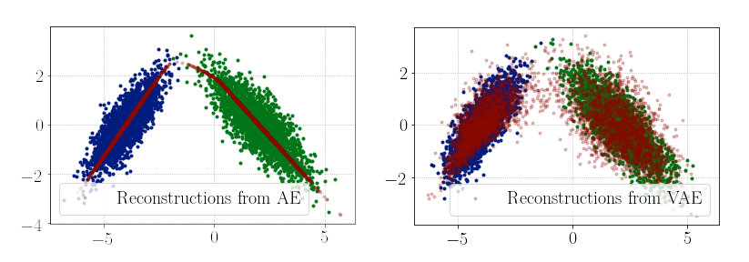
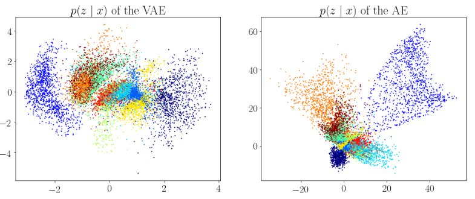
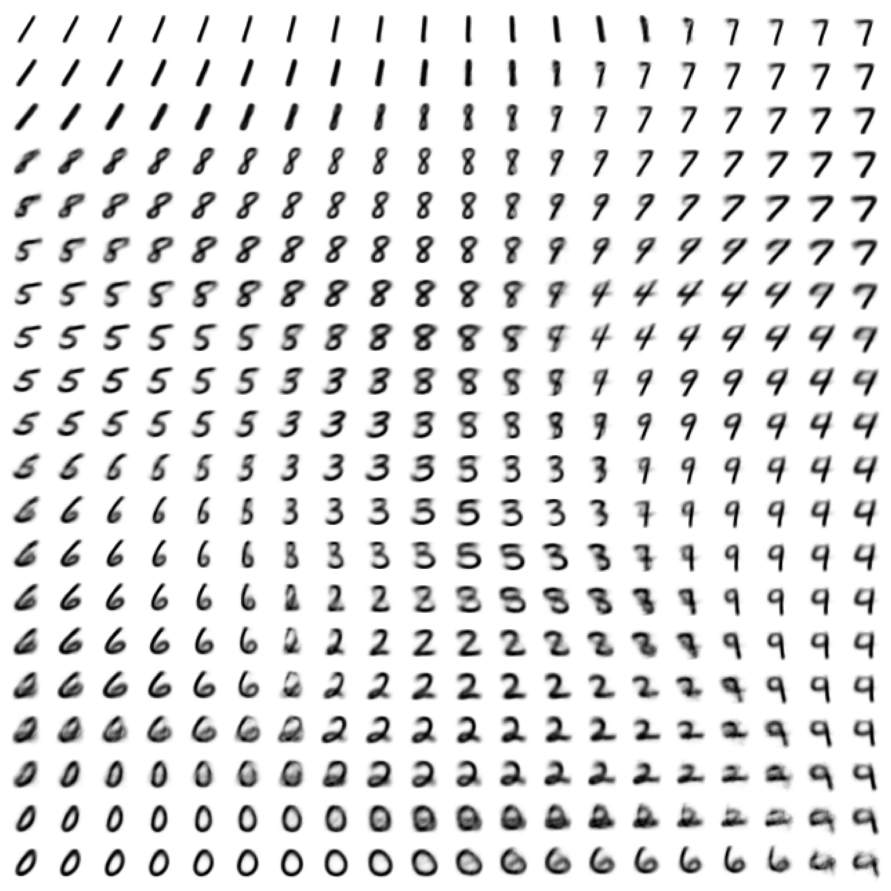
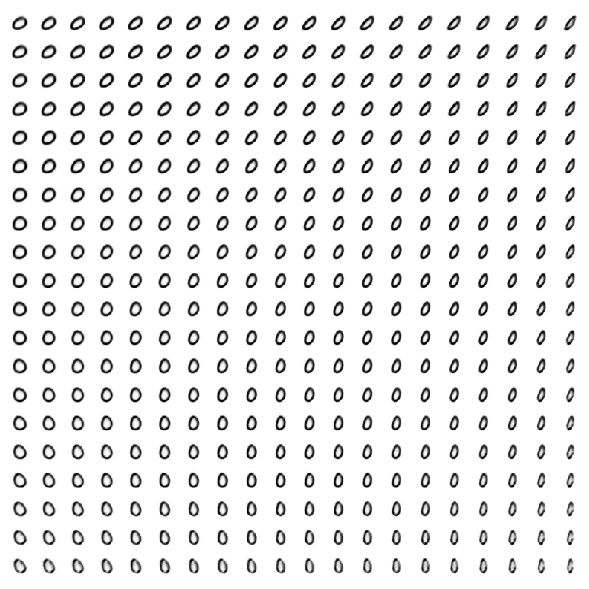
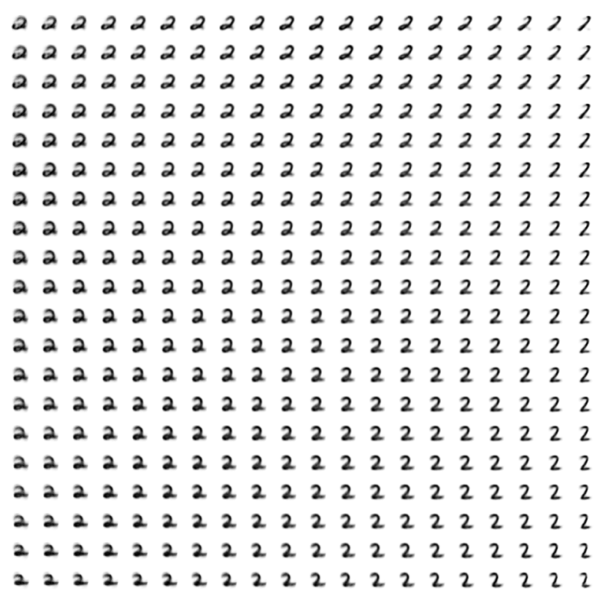

# Minimal VAE and SSL-VAE 

Minimal re-implementation of original VAE [1] and semi-supervised-VAE papers [2]; the former is included in the latter (i.e. the base VAE is dubbed as M1 in [2]).

It includes experiments on synthetic (2D Gaussians and MNIST data.

## M1 (Original VAE [1])

See the notebook `trainer_VAE.ipynb`.

### Synthetic data

First, a vanilla auto-encoder is compared with a variational auto-encoder (using a 1d bottleneck) on a synthetic data (a mixture of two 2d Gaussians).

### MNIST 

Then, training on MNIST takes place, similar to [1]. This achieves similar ELBO as the original paper. One caveat there was that for the log-likelihood of the loss, only a partial term was 
computed involving the MSE between prediction and ground-truth. Optimizing the variance directly there led to instabilities. 

There a comparison between the posterior (using 2d bottleneck) between autoencoder and a VAE is made. 

I also look at the latent space and the corresponding reconstructions when the bottleneck is 2d. This also resulted in qualitatively similar space.

## M2 (SSL-VAE [2])

VAE-SSL setting [2] was explored in `trainer_SSL_VAE.ipynb`. There I only focus on MNIST data. The improvement of unlabeled data is only marginal, suggesting a incorrectness of the code. I also compared computation of the marginalization using "slow, loopy" implementation, but it yielded the same result. 

After training, we can sample the reconstructions when conditioned on the label. A few examples below. 

The notebooks are attempted to be self-explanatory. 

--- 
[1] Kingma, Diederik P., and Max Welling. "Auto-encoding variational bayes." arXiv preprint arXiv:1312.6114 (2013).

[2] Kingma, Durk P., et al. "Semi-supervised learning with deep generative models." Advances in neural information processing systems 27 (2014).
